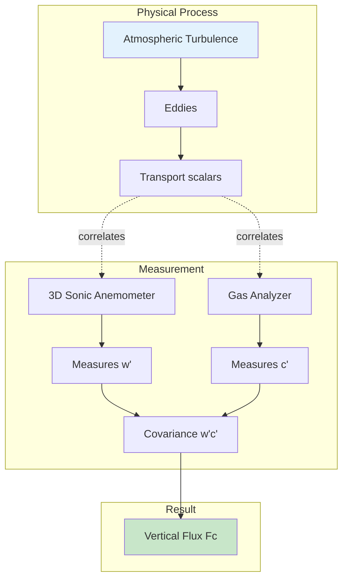

# EC Theory

## What is Eddy Covariance?

The **Eddy Covariance (EC) method** directly measures turbulent fluxes by computing the covariance between high-frequency fluctuations in vertical wind velocity and the scalar of interest (e.g., CO₂, H₂O, temperature).

*Figure: Eddy covariance measures turbulent transport by correlating vertical wind with scalar concentrations*

## Theoretical Basis

### Reynolds Decomposition

Any atmospheric variable can be decomposed into mean and fluctuating components:

$$
c = \overline{c} + c'
$$

where:

- $c$ = instantaneous concentration
- $\overline{c}$ = time-averaged mean concentration
- $c'$ = turbulent fluctuation from the mean

### The Flux Equation

The vertical flux of a scalar is calculated as:

$$
F_c = \overline{w'c'}
$$

where:

- $F_c$ = vertical flux of scalar $c$
- $w'$ = vertical wind velocity fluctuation
- $c'$ = scalar concentration fluctuation
- Overbar denotes time averaging

!!! note "Why This Works"
    When upward air motion ($w' > 0$) consistently carries higher concentrations ($c' > 0$), the covariance $\overline{w'c'}$ is positive, indicating upward flux. The method captures the actual turbulent transport without requiring assumptions about the transfer mechanism.

## Key Assumptions

The EC method relies on several assumptions:

### 1. Stationarity
Turbulent statistics should not change over the averaging period (typically 30 minutes).

**Check**: Divide 30-min period into sub-periods and verify similar statistics.

### 2. Horizontal Homogeneity
Surface properties should be uniform in the flux footprint.

**Implication**: Site selection is critical for representative measurements.

### 3. Negligible Advection
Horizontal and vertical advection should be small compared to turbulent flux.

**When violated**: Over complex terrain or with strong mesoscale flows.

### 4. Complete Turbulent Sampling
The averaging period must capture all relevant turbulent eddies.

**Typical requirement**: 30-60 minute averaging periods.

## Measurement Principle Diagram

