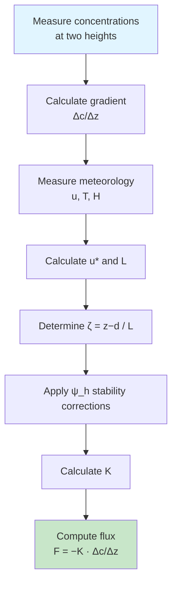

# Calculation Method

## Friction Velocity

The pipeline computes $u_*$ from the 3-D sonic anemometer covariances:

$$
u_* = \left( \overline{u'w'}^2 + \overline{v'w'}^2 \right)^{1/4}
$$

Double coordinate rotation is applied first in `db_process_hhour_sonic` to align the
mean wind vector with the $x$-axis before computing turbulent covariances.

!!! info "Cup anemometer fallback"
    Code for a cup-anemometer-based $u_*$ (iterative log-profile) exists in the MATLAB
    pipeline but is disabled. $u_*$ is always derived from the sonic anemometer.

### Gap-Filling Strategy for u*

When sonic-derived $u_*$ is unavailable for a plot, the pipeline applies the following
fallback hierarchy:

1. **Sonic u\*** from the same plot (primary)
2. **Adjacent-plot u\*** — used when the crop height difference satisfies
   $|h_{\text{diff}}|/h_{\text{mean}} < 1$ (i.e., within 100 % of the mean crop height)
3. **No flux computed** — if no valid $u_*$ source is available

## Stability Functions (Businger-Dyer)

The pipeline uses the **Businger-Dyer formulation with coefficient 15**, implemented in
both the flux function $\phi_h$ and its integrated form $\psi_h$.

### Stability function φ_h

| Condition | Formula |
|-----------|---------|
| Stable (ζ > 0) | $\phi_h = 1 + 4.7\zeta$ |
| Neutral (\|ζ\| ≤ 0.01) | $\phi_h = 1$ |
| Unstable (ζ < 0) | $\phi_h = (1 - 15\zeta)^{-0.5}$ |

### Integrated stability correction ψ_h

Used in the eddy diffusivity calculation:

| Condition | Formula |
|-----------|---------|
| Stable (ζ > 0) | $\psi_h = -4.7\zeta$ |
| Neutral (\|ζ\| ≤ 0.01) | $\psi_h = 0$ |
| Unstable (ζ < 0) | $\psi_h = 2\ln\!\left(\dfrac{1 + x^2}{2}\right)$, where $x = (1 - 15\zeta)^{0.25}$ |

## Canopy Parameters

The MATLAB pipeline derives displacement height and roughness length from crop height
$h_c$, using the following empirically calibrated factors for the Guelph agricultural sites:

| Parameter | Symbol | Formula | Notes |
|-----------|--------|---------|-------|
| Zero-plane displacement | $d$ | $0.67 \times h_c$ | Standard agricultural value |
| Roughness length | $z_0$ | $0.13 \times h_c$ | Site-calibrated; ~30 % larger than the classic 0.10 factor |

Both parameters are defined per-site in the `*_init_all.m` initialization file and can be
updated using dated epochs as crop height changes seasonally.

## Eddy Diffusivity

The integrated eddy diffusivity $K$ is computed from the two sampling heights $z_1$ and $z_2$:

$$
K = \frac{\kappa \cdot u_* \cdot \Delta z}
      {\ln\!\left(\dfrac{z_2 - d}{z_1 - d}\right)
       - \psi_h\!\left(\dfrac{z_2 - d}{L}\right)
       + \psi_h\!\left(\dfrac{z_1 - d}{L}\right)}
$$

where $\Delta z = z_2 - z_1$.

## Flux Calculation

### Step-by-Step Process

### Practical Equation

For concentrations measured at heights $z_1$ and $z_2$:

$$
F_c = -K \cdot \frac{c_2 - c_1}{z_2 - z_1}
$$

In full integrated form:

$$
F_c = -\frac{\kappa \cdot u_* \cdot (c_2 - c_1)}
       {\ln\!\left(\dfrac{z_2-d}{z_1-d}\right)
        - \psi_h\!\left(\dfrac{z_2-d}{L}\right)
        + \psi_h\!\left(\dfrac{z_1-d}{L}\right)}
$$

### Example Calculation

!!! example "Simple Case: Neutral Conditions"
    Given:

    - $c_1 = 410$ ppm at $z_1 = 0.5$ m
    - $c_2 = 405$ ppm at $z_2 = 2.5$ m
    - $u_* = 0.3$ m s⁻¹
    - Neutral stability ($\psi_h = 0$, $\phi_h = 1$)
    - $d = 0.2$ m (0.67 × 0.3 m crop)

    $$K = \frac{0.40 \times 0.3 \times 2.0}{\ln(2.3/0.3)} = \frac{0.240}{2.037} = 0.118 \text{ m}^2\text{s}^{-1}$$

    $$F_{CO_2} = -0.118 \times \frac{405-410}{2.0} = +0.295 \text{ ppm m s}^{-1}$$

## Output Units

| Gas | MATLAB Output Units |
|-----|-------------------|
| N₂O | ng N₂O-N m⁻² s⁻¹ |
| CO₂ | µg CO₂ m⁻² s⁻¹ |

Concentrations are stored internally in ppm (CO₂) or ppb/ppm (N₂O) and converted to flux
units during the `db_calc_FG` stage.

## Sensible Heat Flux Gap-Filling

When the sonic-derived sensible heat flux $\overline{w'T'}$ is unavailable, the pipeline
falls back to:

1. **Sonic-derived H** from the same half-hour (primary)
2. **Neutral assumption** — sets $\psi_h = 0$ (equivalent to $L \rightarrow \infty$)

The neutral assumption introduces a small bias under stable/unstable conditions but is
preferable to discarding the flux estimate entirely.