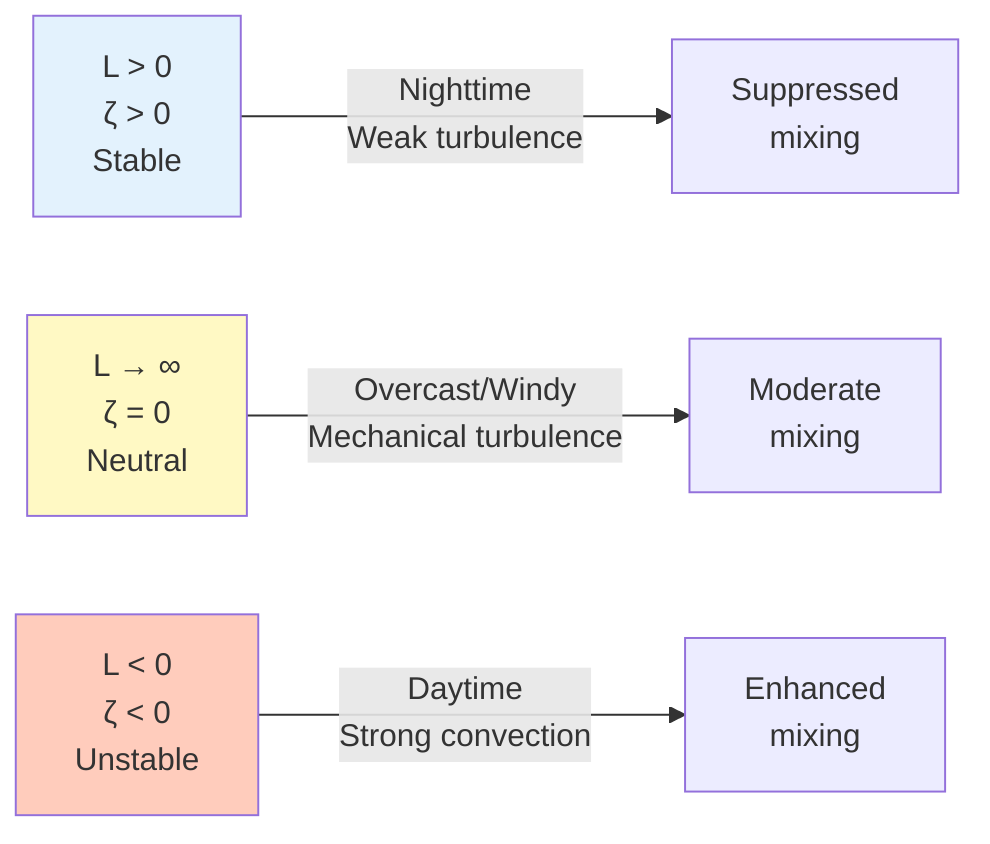

# Theory & MOST

## What is the Flux-Gradient Method?

The **Flux-Gradient (FG) method** estimates vertical fluxes by measuring concentration or temperature
gradients and relating them to turbulent exchange through **Monin-Obukhov Similarity Theory (MOST)**.

The CWR Lab FG system — developed by the Wagner-Riddle group at the University of Guelph —
measures **N₂O and CO₂** fluxes using the Campbell Scientific TGA100A and a dual-height intake
arrangement on each measurement plot.

*Figure: Flux-gradient method uses vertical gradients and turbulent diffusivity*

## Physical Constants

The MATLAB pipeline uses the following physical constants, appropriate for the University of Guelph
site location (~43.5 °N):

| Constant | Symbol | Value | Units |
|----------|--------|-------|-------|
| von Kármán constant | κ | 0.40 | — |
| Gravitational acceleration | g | 9.81 | m s⁻² |
| Universal gas constant | R | 8.31451 | J mol⁻¹ K⁻¹ |
| Specific gas constant (dry air) | R_d | 287.05 | J kg⁻¹ K⁻¹ |
| Molar mass of dry air | M_air | 28.96 | g mol⁻¹ |
| Molar mass of CO₂ | M_CO₂ | 44.01 | g mol⁻¹ |
| Molar mass of N₂O | M_N₂O | 44.01 | g mol⁻¹ |

!!! note "Gravity at Guelph"
    g = 9.81 m s⁻² is the appropriate value for ~43.5 °N latitude.
    Gravitational acceleration increases toward the poles due to Earth's oblate shape
    and rotation; using a geographically accurate value reduces systematic error in the
    Obukhov length calculation.

## Theoretical Foundation

### Basic Principle

Flux is proportional to the concentration gradient:

$$
F_c = -K_c \frac{\partial c}{\partial z}
$$

where:

- $F_c$ = vertical flux of scalar $c$
- $K_c$ = eddy diffusivity for scalar $c$ (m² s⁻¹)
- $\frac{\partial c}{\partial z}$ = vertical concentration gradient

!!! note "The Challenge"
    Unlike molecular diffusion where diffusivity is constant, **eddy diffusivity** $K_c$
    varies with atmospheric stability, wind speed, and measurement height.
    MOST provides the theoretical framework to determine $K_c$.

## Monin-Obukhov Similarity Theory (MOST)

### Obukhov Length

Atmospheric stability is characterised by the **Obukhov length** $L$:

$$
L = -\frac{u_*^3 \cdot T_v}{\kappa \cdot g \cdot \overline{w'T'}}
$$

where:

- $u_*$ = friction velocity (m s⁻¹)
- $T_v$ = virtual temperature (K) — the MATLAB pipeline uses virtual temperature
  (rather than sonic temperature alone) to apply a proper humidity correction
- $\kappa$ = 0.40 (von Kármán constant)
- $g$ = 9.81 m s⁻²
- $\overline{w'T'}$ = kinematic sensible heat flux (K m s⁻¹)

### Stability Parameter

The dimensionless stability parameter:

$$
\zeta = \frac{z - d}{L}
$$

where $z$ is measurement height (m) and $d$ is zero-plane displacement (m).

### Atmospheric Stability Classes

**Valid stability range used by the pipeline:**

| Condition | Threshold | Action |
|-----------|-----------|--------|
| Very stable | ζ > 2 | K set to NaN — excluded from flux calculation |
| Very unstable | ζ < −5 | K set to NaN — excluded from flux calculation |
| Near-neutral | \|ζ\| ≤ 0.01 | Neutral functions applied |