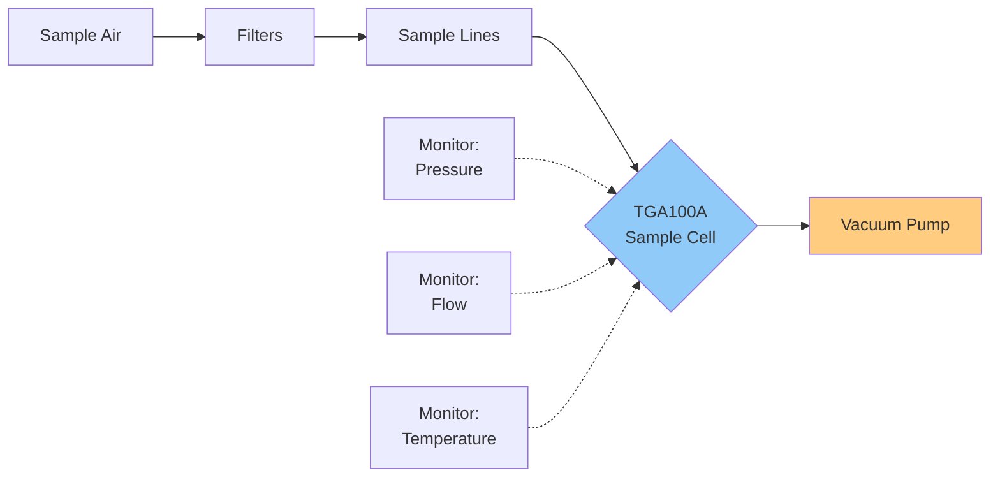

# System Overview & Cycle

This section documents the diagnostic variables and operational parameters of the
**Campbell Scientific TGA100A Trace Gas Analyzer**, which forms the core of the
flux-gradient measurement system at ON1.

!!! info "Variable Context"
    All TGA variables are computed at **30-minute intervals** from high-frequency (10 Hz)
    measurements. These diagnostic parameters monitor system health and data quality.

## Overview: TGA100A Operation

The TGA100A uses **tunable diode laser absorption spectroscopy** to measure N₂O and CO₂
concentrations in a temperature- and pressure-controlled sample cell.

### Key Specifications

| Parameter | Value |
|-----------|-------|
| Target gases | N₂O and CO₂ |
| Measurement frequency | 10 Hz |
| Sample cell path length | 153.08 cm |
| Operating pressure | 50–80 mb |
| Sample flow range | 500–2000 ml/min |
| Cooling system | Liquid nitrogen (LN₂) |
| Precision (N₂O) | < 0.3 ppb |
| Precision (CO₂) | < 0.1 ppm |

## Measurement Cycle

### Level Timing

The TGA cycles through intakes sequentially. Each level receives **60 seconds** of sampling,
and an initial **omit period of 10–15 seconds** (configurable per plot in `*_init_all.m`)
is discarded to allow the sample line to flush after a valve switch.

| Stage | Duration | Notes |
|-------|----------|-------|
| Reference gas (zero) | 30 s | Baseline zero measurement |
| Per-level sampling | 60 s | Valid window after omit period |
| Omit period (start of level) | 10–15 s (configurable) | Flush time — discarded |
| Minimum valid level | ≥ 12 s | Below this, half-hour is rejected |

With a 4-plot system, **one complete cycle** (reference + 4 plots × 2 heights + reference)
takes approximately 10 minutes, giving ~3 measurements per plot per 30-minute period.

!!! note "Temporal coverage"
    Each plot receives roughly **1 flux estimate per 2 hours** in a 4-plot cycle
    (since each full cycle covers all plots, and fluxes are averaged over the 30-minute window).

### Tube Delay

The pipeline estimates tube delay using **sine-curve fitting to the CO₂ signal** during the
nighttime window (20:30–07:30 local time). The estimated delay is stored in the init file and
applied during structure processing.

| Parameter | Value |
|-----------|-------|
| Estimation method | Sine-curve fitting to CO₂ signal |
| Time window | Nighttime (20:30–07:30) |
| Typical delay (TGA100A) | 2–6 seconds |
| Override mechanism | Override file for corrections |

The `shiftDefault` parameter in `*_init_all.m` holds the current best estimate; it should be
reviewed and updated when plumbing is modified or when new lag estimates become available.

### Zero and Negative Concentrations

Any zero or negative concentration readings are **converted to NaN** before further processing.
These represent non-physical values caused by electrical noise, ADC saturation, or sample
cell contamination.