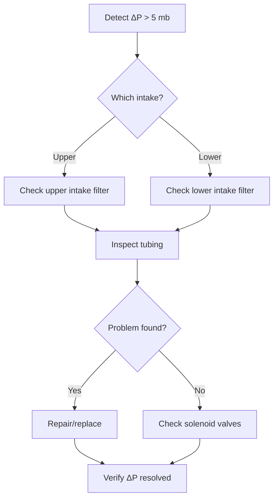

# Pressure & Flow Variables

## Sample Pressure

**Units:** mb (millibars)

The pressure inside the TGA sample cell directly controls measurement accuracy:
it determines the molecular number density along the laser absorption path.

**Operating range:** 50–80 mb

**Quality control requirements:**

- Record daily and compare to 7-day moving average
- Flag if deviation > 10 % from baseline
- Investigate immediately if declining trend indicates filter clogging
- Check pump performance if sample pressure drops below 50 mb

!!! danger "Critical Parameter"
    Sample pressure directly affects measurement accuracy. Variations > 5 mb from
    typical operation should be investigated immediately.

**QA/QC Thresholds:**

| Parameter | Min | Max | Flag Action |
|-----------|-----|-----|-------------|
| Sample Pressure | 50 mb | 80 mb | Check pump, filters, or plumbing |
| Acceptable operating range | 300 mb | 400 mb (30–40 kPa) | Flag if outside range |

## Delta Sample Pressure

**Units:** mb (millibars)

Pressure difference between the upper and lower intakes in the multi-plot configuration.

**Acceptable range:** < 5 mb (< 0.075 kPa for each switching event)

Large ΔP between intakes indicates a flow imbalance that biases residence times and can
affect gradient measurements.

!!! failure "Red Flag"
    ΔP > 5 mb between intakes indicates:
    - Blockage in one sampling line
    - Filter clogging at a specific intake
    - Bent or kinked tubing
    - Insect or debris in intake

**Troubleshooting Workflow:**

## TGA Pressure

**Units:** mb (millibars)

Operating pressure inside the analyzer body (separate from sample cell pressure in some
configurations). Must remain stable for consistent laser alignment and absorption.

**Typical range:** 50–80 mb

## Bypass Pressure

**Units:** mb (millibars)

Pressure in the bypass line of the multi-intake sampling system. The bypass maintains
constant pressure while allowing sequential sampling from different intakes.

Sudden changes in bypass pressure indicate:

- Leak in sampling system
- Blocked intake line
- Pump malfunction
- Solenoid valve failure

## Sample Flow

**Units:** ml min⁻¹

Flow rate of air through the TGA sample cell.

**Operating range:** 500–2000 ml min⁻¹ (site-specific optimum)

The flow rate is adjusted to achieve ~90 % laser transmittance — the balance between
fresh sample replenishment and adequate absorption signal.

**Quality control:**

- Monitor for gradual decline (filter plugging — typical 10 % over 2–4 weeks)
- Investigate sudden drops immediately (leak or pump failure)
- Flag if flow changes > 5 % between consecutive 30-minute periods

## Delta Sample Flow

**Units:** ml min⁻¹

Difference in flow rates between the upper and lower intakes.

Equal flow rates ensure comparable residence times, identical moisture conditioning,
and unbiased concentration comparisons between intake heights. Persistent imbalance
should be corrected by checking filters, verifying equal line lengths, or adding
flow restrictors.

## Quality Control: Outlier Threshold

The pipeline counts the number of 10 Hz samples flagged as outliers within each
30-minute period. If more than **100 outlier samples** are present in a half-hour,
the entire half-hour is rejected.