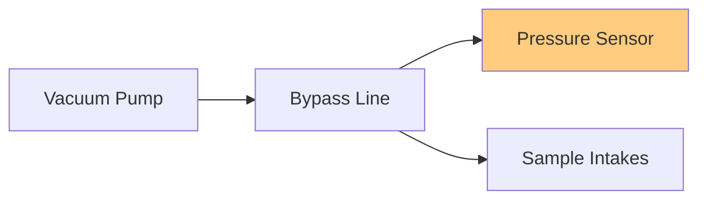
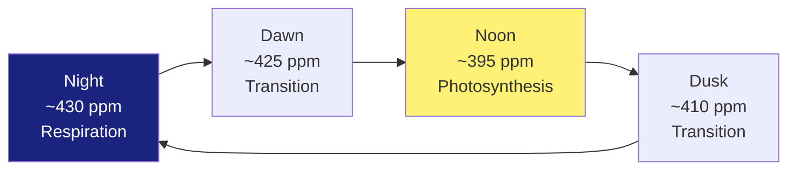

# Flux-Gradient Variables

This page documents diagnostic variables for the flux-gradient (FG) measurement system.

## TGA Pressures

### Bypass Pressure

| | |
|---|---|
| **Symbol** | P_bypass |
| **Units** | mb (millibars) |
| **Definition** | Pressure in the bypass line of the TGA sampling system |
| **Purpose** | Monitors pressure control in the multi-intake sampling system |
| **Typical Range** | Site-specific; depends on pump capacity and flow rates |

**Quality Control**:
- Should remain stable during operation
- Changes indicate plumbing problems or leaks
- Monitor for drift over time

### Sample Pressure

| | |
|---|---|
| **Symbol** | P_sample |
| **Units** | mb (millibars) |
| **Definition** | Pressure in the TGA sample cell during measurement |
| **Purpose** | Critical for accurate concentration calculations; used in gas density conversions |
| **Typical Range** | 40-100 mb (controlled by vacuum pump) |

!!! danger "Critical Parameter"
    Sample pressure directly affects measurement accuracy. Changes > 5 mb from typical operation require immediate investigation.

**Quality Control**:
- Record **daily** and compare to historical values
- Changes indicate problems with flows/pressures in sampling system
- Will decrease over time as filters become plugged

**Daily Monitoring Protocol**:
1. Record at start of day
2. Compare to 7-day moving average
3. Flag if deviation > 10%
4. Investigate declining trends

## TGA Flows

### Sample Flow

| | |
|---|---|
| **Symbol** | Q_sample |
| **Units** | ml/min (milliliters per minute) |
| **Definition** | Flow rate of air through the TGA sample cell |
| **Purpose** | Determines residence time and affects measurement precision |
| **Typical Range** | 500-2000 ml/min (site-specific) |

**Flow-Pressure Optimization**:

The optimal flow rate balances:
- Higher flow → Fresh sample, reduced memory effects
- Lower flow → Better signal-to-noise, more absorption
- Target: ~90% laser transmittance

## Gas Concentrations

### N₂O Concentration

| | |
|---|---|
| **Symbol** | [N₂O] |
| **Units** | ppb (parts per billion) |
| **Definition** | Nitrous oxide mole fraction in air sample |
| **Purpose** | Primary measurement for N₂O flux calculations |
| **Typical Range** | 320-350 ppb background; higher over agricultural soils |

**Agricultural Context**:
- Background atmospheric: ~333 ppb
- Enhanced by: Fertilizer application, soil disturbance
- Temporal patterns: Episodic emissions, freeze-thaw events

### CO₂ Concentration

| | |
|---|---|
| **Symbol** | [CO₂] |
| **Units** | ppm (parts per million) |
| **Definition** | Carbon dioxide mole fraction in air sample |
| **Purpose** | For CO₂ flux calculations, comparison with EC system |
| **Typical Range** | 400-450 ppm depending on time of day and season |

**Diurnal Pattern**:
