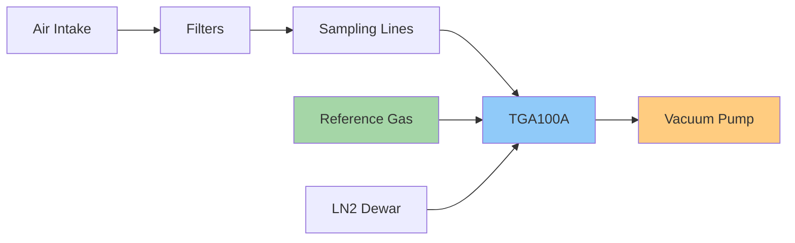

# Flux-Gradient Instrumentation

## Primary Instrument: TGA100A Trace Gas Analyzer

{ align=right width="400" }

The Campbell Scientific TGA100A is the heart of the flux-gradient measurement system.

### Technology
- **Measurement principle**: Tunable diode laser absorption spectroscopy
- **Measurement frequency**: 10 Hz
- **Target gases**: N₂O and CO₂
- **Path length**: 153.08 cm (sample cell)
- **Cooling system**: Liquid nitrogen (LN₂) for laser stabilization

### Measurement Approach
Multi-plot flux-gradient using dual-ramp absorption spectroscopy enables precise concentration measurements at multiple sampling heights.

!!! info "TGA100A Specifications"
    | Parameter | Specification |
    |-----------|--------------|
    | Sample cell path | 153.08 cm |
    | Operating pressure | 50-80 mb |
    | Sample flow | 500-2000 ml/min |
    | Measurement frequency | 10 Hz |
    | Precision (N₂O) | < 0.3 ppb |
    | Precision (CO₂) | < 0.1 ppm |

## Supporting Components

The TGA system requires several supporting components for proper operation:

- **Sampling system**: Multi-height intake with automated switching
- **Vacuum pump**: Maintains controlled sample pressure
- **Reference gas supply**: For calibration and drift correction
- **Temperature and pressure sensors**: For gas density corrections
- **Automated calibration system**: Periodic zero and span checks