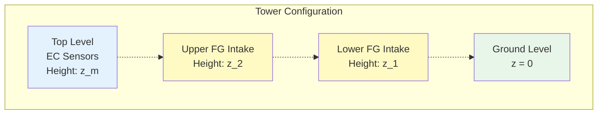

# Sensor Placement & Maintenance

## Sensor Placement and Geometry

### Typical Heights (Site-Specific)

!!! example "Example Configuration"
    | Level | Height (m) | Measurement |
    |-------|-----------|-------------|
    | EC sensors | 3.0 | Direct fluxes |
    | FG upper intake | 2.5 | Concentration C₂ |
    | FG lower intake | 0.5 | Concentration C₁ |
    | Canopy height | 0.3 | Reference level |

## Maintenance Schedule

### Daily Checks
- [ ] TGA sample pressure and flow
- [ ] EC data quality flags
- [ ] Visual inspection of sensors
- [ ] Check data logger connection

### Weekly Checks
- [ ] Clean EC sensor windows
- [ ] Check TGA LN₂ level
- [ ] Inspect sampling lines for leaks
- [ ] Review data quality metrics

### Monthly Checks
- [ ] Full system calibration
- [ ] Replace inlet filters
- [ ] Check all electrical connections
- [ ] Backup data and logs

### Quarterly Maintenance
- [ ] Professional calibration service
- [ ] Replace consumables
- [ ] Detailed performance review
- [ ] Update site documentation