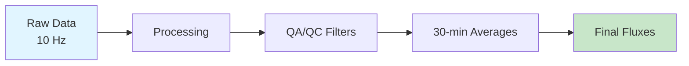

# Site, Data & Methods

## Site Overview

The main long-term site at Elora, Ontario (ON1) employs two complementary micrometeorological measurement techniques for quantifying greenhouse gas and energy fluxes. Understanding both methods allows for cross-validation and comprehensive flux characterization.

## 1. Flux-Gradient (FG) Method
The flux-gradient method uses **vertical concentration gradients** to estimate fluxes. This semi-empirical approach requires parameterization of turbulent exchange through eddy diffusivity.

**Key characteristics:**

- Measures concentration differences at multiple heights
- Applies Monin-Obukhov Similarity Theory (MOST)
- More compact footprint than EC
- Better suited for heterogeneous surfaces
- Requires stable atmospheric conditions

## 2. Eddy Covariance (EC) Method
The eddy covariance method provides **direct turbulent flux measurements** by correlating high-frequency fluctuations in wind and scalar concentrations.

**Key characteristics:**

- Direct flux measurement (no assumptions about turbulent transfer)
- High-frequency data collection (10 Hz)
- Widely accepted as standard method
- Larger spatial footprint
- Works in various stability conditions

## Why Two Methods?

!!! note "Complementary Approaches"
    Using both FG and EC methods provides:

    - **Validation**: Agreement within 20-30% indicates well-functioning systems
    - **Redundancy**: Backup measurements if one system fails
    - **Different footprints**: Better spatial coverage
    - **Method comparison**: Research and method development opportunities

## Data Collection

All diagnostic variables are computed at **30-minute intervals** from high-frequency raw measurements.

## Measurement Frequency

| System | Raw Frequency | Output Interval | Variables |
|--------|--------------|-----------------|-----------|
| EC System | 10 Hz | 30 minutes | CO₂, H₂O, momentum, heat |
| FG System | 10 Hz | 30 minutes | N₂O, CO₂, gradients |