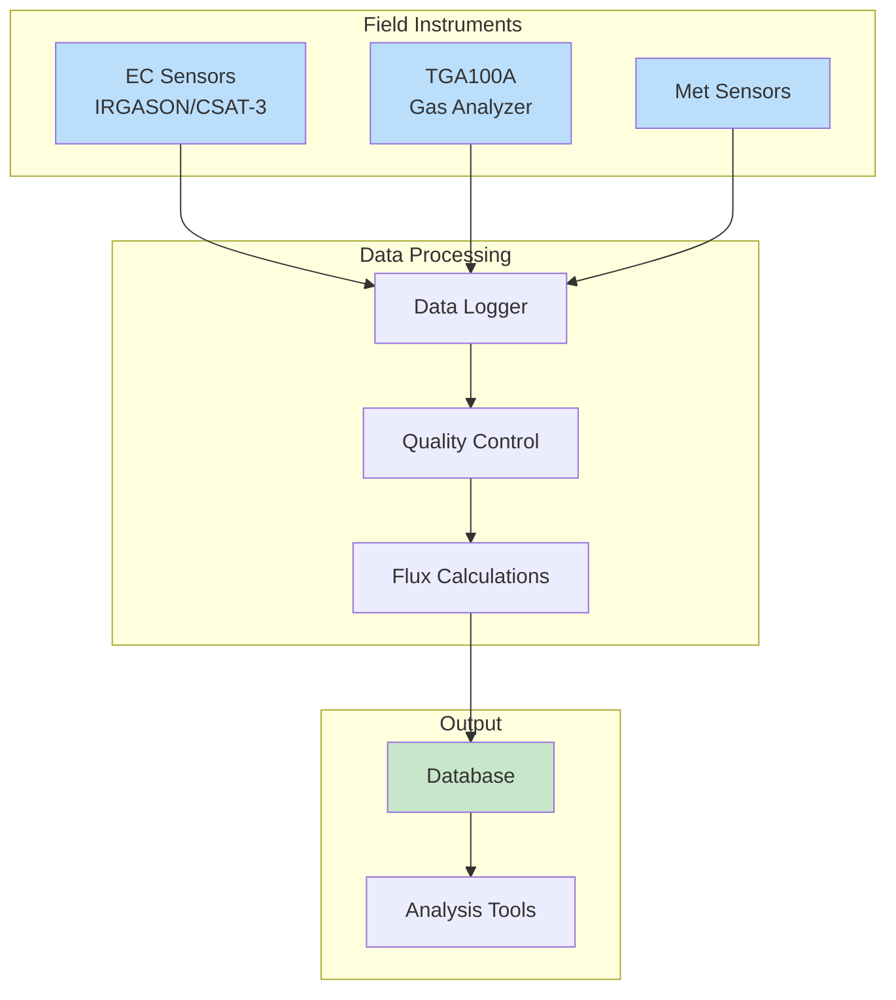

# Media

## Site Photographs

{ width="600" }
*Figure 1: ON1 tower showing instrument placement*

{ width="300" }
*EC sensor configuration*

{ width="300" }
*TGA100A analyzer system*

## Data Flow Diagram

## Video: Site Setup Tutorial

Below is an introductory video explaining the site setup:

  📹 Video: Introduction to flux measurement workflow, Parts 1–8 — available in the online documentation.

## Video: Introduction to Flux Measurement

  <video width="100%" controls>
    <source src="../../videos/flux-intro.mp4" type="video/mp4">
    Your browser does not support the video tag.
  </video>

📹 Video: Basic principles of flux measurements (15 min) — available in the online documentation at the project site.

*Video 1: Basic principles of flux measurements (15 minutes)*
