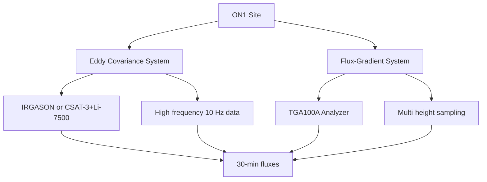

# About the Site

## Location and Setting

!!! info "Site Coordinates"
    - **Site Code**: ON1
    - **Location**: [To be added]
    - **Coordinates**: [Latitude, Longitude]
    - **Elevation**: [meters above sea level]
    - **Time Zone**: [Local time zone]

## Land Use and Vegetation

### Current Land Use
[Description of current agricultural or natural land use at the site]

### Vegetation Characteristics

| Parameter | Value/Description |
|-----------|------------------|
| Dominant species | [List main plant species] |
| Canopy height (hc) | [meters] |
| Leaf Area Index (LAI) | [m²/m²] |
| Growing season | [Months/dates] |
| Management | [Tillage, fertilization, irrigation] |

### Seasonal Variation

=== "Spring"
    - Crop emergence
    - Typical canopy height: [height]
    - LAI development stage

=== "Summer"
    - Peak growth period
    - Maximum canopy height: [height]
    - Maximum LAI: [value]

=== "Fall"
    - Harvest period
    - Senescence stage
    - Crop residue management

=== "Winter"
    - Bare soil or cover crop
    - Minimal vegetation
    - Potential snow cover

## Climate

### Annual Climate Summary

| Parameter | Value | Notes |
|-----------|-------|-------|
| Mean annual temperature | [°C] | |
| Mean annual precipitation | [mm] | |
| Growing degree days | [GDD] | Base 5°C |
| Frost-free period | [days] | |
| Prevailing wind direction | [direction] | |

### Climate Normals (1991-2020)

*Figure: Monthly temperature and precipitation normals*

## Soil Characteristics

### Soil Type and Classification

- **Soil Order**: [Classification]
- **Texture**: [Clay/Loam/Sand percentages]
- **Drainage**: [Well/Moderately/Poorly drained]
- **pH**: [value]
- **Organic matter content**: [%]

### Soil Profile

| Horizon | Depth (cm) | Description |
|---------|-----------|-------------|
| A | 0-20 | [Description] |
| B | 20-60 | [Description] |
| C | 60+ | [Description] |

## Site Diagram

## Photo Gallery

-   

    **Tower Overview**

    View from south showing instrument placement

-   

    **EC Sensors**

    IRGASON mounted at measurement height

-   

    **TGA System**

    Interior showing TGA100A installation

-   

    **Aerial View**

    Tower location within field

