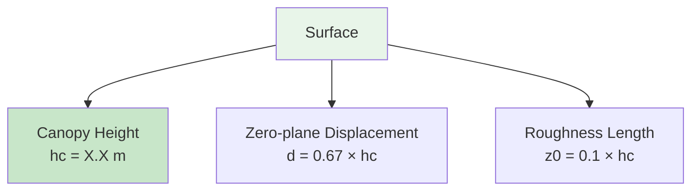
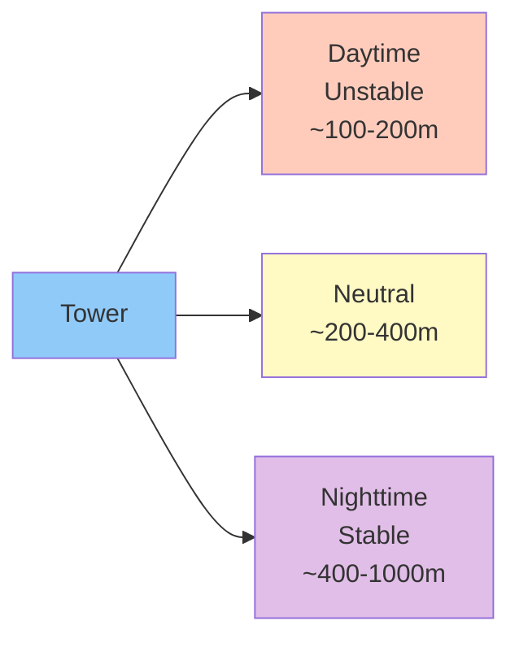

# Measurement Setup

## Tower Configuration

### Measurement Heights

*Figure: Vertical profile of instrumentation*

| Instrument/Sensor | Height (m) | Purpose |
|------------------|-----------|---------|
| EC sensors (IRGASON/CSAT-3) | [height] | Turbulent fluxes |
| FG upper intake | [height] | Concentration C₂ |
| FG lower intake | [height] | Concentration C₁ |
| Air temperature | [heights] | Profile measurements |
| Wind speed | [heights] | Profile measurements |

### Surface Roughness Parameters

| Parameter | Symbol | Value | Notes |
|-----------|--------|-------|-------|
| Canopy height | hc | [m] | Seasonal variation |
| Displacement height | d | [m] | ~0.67 × hc |
| Roughness length | z₀ | [m] | ~0.1 × hc |
| Measurement height | zm | [m] | EC sensors |

## Flux Footprint

### Typical Footprint Characteristics

The spatial area contributing to flux measurements varies with:

- **Atmospheric stability**: Larger under stable, smaller under unstable
- **Wind speed**: Scales with mean wind
- **Measurement height**: Linear scaling
- **Surface roughness**: Affects near-field contribution

### Footprint Analysis

**Typical footprint distances:**

| Condition | Peak contribution | 80% cumulative | 90% cumulative |
|-----------|------------------|----------------|----------------|
| Unstable | ~50m | ~150m | ~300m |
| Neutral | ~100m | ~300m | ~600m |
| Stable | ~200m | ~600m | ~1200m |

### Site Homogeneity

!!! warning "Fetch Requirements"
    For representative measurements, the footprint area should be:

    - ✓ Homogeneous in land cover
    - ✓ Uniform in management
    - ✓ Representative of target ecosystem
    - ✗ Avoid roads, buildings, different crops

## Surrounding Environment

### Land Use Map

*Figure: Aerial view showing tower location and surrounding land use*

### Nearby Features

| Direction | Distance | Feature | Impact on measurements |
|-----------|---------|---------|----------------------|
| North | [m] | [Feature] | [Potential influence] |
| East | [m] | [Feature] | [Potential influence] |
| South | [m] | [Feature] | [Potential influence] |
| West | [m] | [Feature] | [Potential influence] |

## Typical Flux Magnitudes

### Expected Flux Ranges

Based on similar sites and preliminary data:

| Flux | Growing Season | Non-Growing Season | Units |
|------|---------------|-------------------|-------|
| CO₂ (daytime) | -5 to -20 | -2 to -5 | μmol/m²/s |
| CO₂ (nighttime) | +2 to +10 | +1 to +3 | μmol/m²/s |
| N₂O | 0 to +50 | 0 to +20 | ng/m²/s |
| H (sensible heat) | 50 to 300 | -50 to 100 | W/m² |
| LE (latent heat) | 100 to 500 | 0 to 100 | W/m² |

!!! note "Site-Specific Values"
    These ranges will be refined as more data is collected. Actual values depend on:

    - Crop type and growth stage
    - Management practices
    - Weather conditions
    - Soil moisture