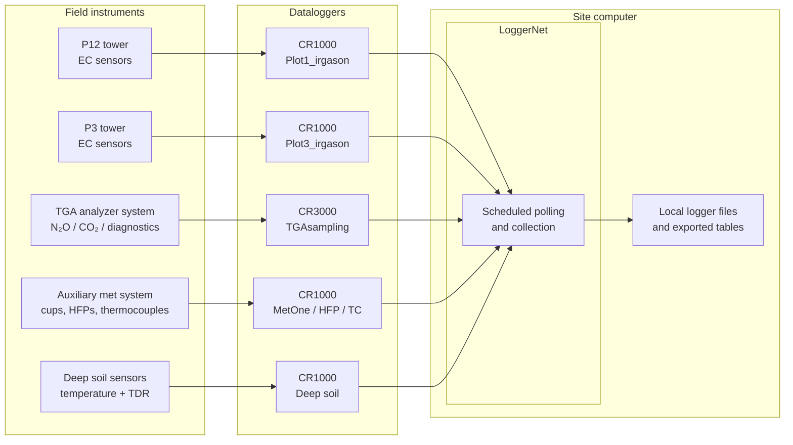

# Collection Architecture & Inventory

This page documents how measurements are acquired at the ON1 field site, from instruments and dataloggers to the site computer, before the data enter the transfer and processing pipelines.

This is the **first layer** of the broader operational workflow:

> **Data Collection → Data Transfer → Processing (EC / FG) → QA/QC → Archive**

For downstream movement of these files from the site computer to lab systems, see **[Transfer Architecture & Workflow](../data-transfer/architecture-workflow.md)**.

## 1. Collection Architecture

At ON1, multiple Campbell Scientific dataloggers collect data from eddy-covariance, flux-gradient, auxiliary meteorological, and soil-sensor systems. Most of these loggers are connected to the **site computer**, where **LoggerNet** is installed and used for scheduled data collection. One legacy shallow-soil logger is not part of the LoggerNet path and is retrieved manually in the field.

!!! note "Notes:"

    - The **dataloggers** are the field devices that perform measurement, local processing, and table storage.
    - The **site computer** is the field-side collection hub.
    - **LoggerNet** software retrieves supported logger tables and stores them locally for later transfer.
    - The shallow-soil CR23X logger is excluded from this automated path.

## 2. Logger Inventory and Roles

| Logger program | Logger model | Primary role | Main measurements / functions | Collection path | Notes |
| --- | --- | --- | --- | --- | --- |
| `Plot1_irgason_20260323.CR1` | CR1000 | EC tower logger (`P12_tower`) | High-frequency EC variables, online covariances, tower meteorology | LoggerNet | Shares table structure with Plot3 program. |
| `Plot3_irgason_20260323.CR1` | CR1000 | EC tower logger (`P3_tower`) | High-frequency EC variables, online covariances, tower meteorology | LoggerNet | Shares table structure with Plot1 program. |
| `TGAsampling_20260401.CR3` | CR3000 | FG / TGA system logger | TGA control, valve sequence, pressures, flows, diagnostics, site averages | LoggerNet | Acquisition-and-control logger, not just a passive recorder. |
| `CR1000_MetOne_010C_5_cups_HFP_TC_13June2024.CR1` | CR1000 | Auxiliary meteorological / surface logger | 5 cup anemometers, 2 soil heat flux plates, 4 thermocouples | LoggerNet | Produces 30-minute support tables. |
| `E26_Deep_CR1000_TDR_TC_V18Aug2021.CR1` | CR1000 | Deep soil logger | 16 deep soil temperature channels + 16 deep TDR channels | LoggerNet | Produces 10-minute TC and TDR profile tables plus logger stats. |
| `Pedro_shallow_P12_SRJ_20260323.dld` | CR23X | Legacy shallow soil logger | 8 shallow temperature channels + 8 shallow TDR-related channels | Manual | Not connected to LoggerNet on the site computer. |

!!! note "Notes:"

    - The **five automated loggers** are the two EC tower loggers, the TGA logger, the auxiliary met logger, and the deep-soil logger.
    - The automated collection path is based on Campbell Scientific **LoggerNet** installed on the site computer.
    - LoggerNet periodically polls supported dataloggers and stores their exported data tables locally.
    - The site computer acts as a **staging point** for downstream transfer scripts and workflows.
    - The **manual logger** is the shallow-soil **CR23X** system.
    - The shallow-soil **CR23X** system is not supported by the LoggerNet version installed on the site computer. As a result, the shallow-soil workflow remains manual.