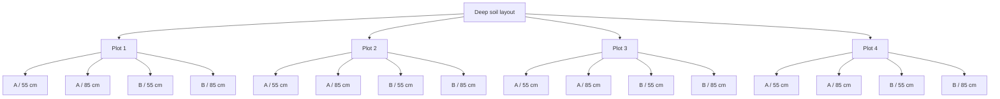

# Met & Soil Logger Variables

This page documents output tables and variable structure for the auxiliary meteorological, deep soil, and shallow soil loggers. See [EC & TGA Logger Variables](ec-tga-variables.md) for the eddy-covariance and TGA loggers.

## Auxiliary Meteorological Logger (`CR1000_MetOne_010C_5_cups_HFP_TC`)

### Declared variables

| Variable | Interpretation |
| --- | --- |
| `BattV` | Battery voltage |
| `PTemp_C` | Logger panel temperature |
| `Cup_1` to `Cup_5` | Cup-anemometer channels |
| `Temp_C(1..4)` | Thermocouple channels |
| `SHF` | Soil heat flux plate 1 |
| `SHF_2` | Soil heat flux plate 2 |

### Output tables

| Table | Interval | Variables / contents |
| --- | --- | --- |
| `Cups_All` | 30 min | `BattV`, `PTemp_C`, `Cup_1` to `Cup_5` averages |
| `HFP_1` | 30 min | `SHF`, `Temp_C(1)`, `Temp_C(2)` averages |
| `HFP_2` | 30 min | minimum `BattV`, `SHF_2`, `Temp_C(3)`, `Temp_C(4)` averages |

!!! note "Notes:"

    - The main scan is 1 second.
    - Cup channels are pulse-count-based wind measurements.
    - The logger applies a low-speed threshold: any instantaneous reading below 0.28 m/s is set to zero (`If Cup_X < 0.28 Then Cup_X = 0`). This corresponds to the MetOne 010C start threshold and explains the zero values that appear in the data during calm conditions.

## Deep Soil Logger (`E26_Deep_CR1000_TDR_TC`)

### Declared variables

| Variable/group | Interpretation |
| --- | --- |
| `BattV`, `PTemp_C` | Logger health / status |
| `VW(1..16)` | Calculated volumetric water content values |
| `PA_uS(1..16)` | Raw / intermediate CS616 period values (microseconds) |
| `RTempC` | Reference temperature |
| `Temp_C(1..16)` | Thermocouple temperature values |

### Deep-soil layout logic

- **4 plots**
- **2 replicated positions per plot**
- **2 depths per replicated position**
- **55 cm**
- **85 cm**

This produces 16 temperature and 16 TDR entries.

### Deep soil output tables

| Table | Interval | Contents |
| --- | --- | --- |
| `Deep_TDR` | 10 min | 16 deep-soil water content (`VW_...`) values plus matching `PA_uS_...` values |
| `Deep_TC` | 10 min | 16 deep-soil temperature values |
| `LoggerStats` | 1440 min (daily) | minimum battery voltage and panel temperature |

### `Deep_TDR` variable mapping

| Plot | Position / depth | Variables |
| --- | --- | --- |
| P1 | 55A | `VW_P1_55A`, `PA_uS_P1_55A` |
| P1 | 85A | `VW_P1_85A`, `PA_uS_P1_85A` |
| P1 | 55B | `VW_P1_55B`, `PA_uS_P1_55B` |
| P1 | 85B | `VW_P1_85B`, `PA_uS_P1_85B` |
| P2 | 55A | `VW_P2_55A`, `PA_uS_P2_55A` |
| P2 | 85A | `VW_P2_85A`, `PA_uS_P2_85A` |
| P2 | 55B | `VW_P2_55B`, `PA_uS_P2_55B` |
| P2 | 85B | `VW_P2_85B`, `PA_uS_P2_85B` |
| P3 | 55A | `VW_P3_55A`, `PA_uS_P3_55A` |
| P3 | 85A | `VW_P3_85A`, `PA_uS_P3_85A` |
| P3 | 55B | `VW_P3_55B`, `PA_uS_P3_55B` |
| P3 | 85B | `VW_P3_85B`, `PA_uS_P3_85B` |
| P4 | 55A | `VW_P4_55A`, `PA_uS_P4_55A` |
| P4 | 85A | `VW_P4_85A`, `PA_uS_P4_85A` |
| P4 | 55B | `VW_P4_55B`, `PA_uS_P4_55B` |
| P4 | 85B | `VW_P4_85B`, `PA_uS_P4_85B` |

### `Deep_TC` variable mapping

| Plot | Position / depth | Temperature field |
| --- | --- | --- |
| P1 | 55A | `TempP_C_P1_55A` |
| P1 | 85A | `Temp_C_P1_85A` |
| P1 | 55B | `Temp_C_P1_55B` |
| P1 | 85B | `Temp_C_P1_85B` |
| P2 | 55A | `Temp_C_P2_55A` |
| P2 | 85A | `Temp_C_P2_85A` |
| P2 | 55B | `Temp_C_P2_55B` |
| P2 | 85B | `Temp_C_P2_85B_` |
| P3 | 55A | `Temp_C_P3_55A` |
| P3 | 85A | `Temp_C_P3_85A` |
| P3 | 55B | `Temp_C_P3_55B` |
| P3 | 85B | `Temp_C_P3_85B` |
| P4 | 55A | `Temp_C_P4_55A` |
| P4 | 85A | `Temp_C_P4_85A` |
| P4 | 55B | `Temp_C_P4_55B` |
| P4 | 85B | `Temp_C_P4_85B` |

### Conceptual deep-soil layout

## Shallow Soil Logger (`Pedro_shallow...` / CR23X)

### Declared / labeled variables

| Variable/group | Interpretation |
| --- | --- |
| `BattV`, `ProgSig`, `PTemp_C` | Logger status / health |
| `Temp_C_1` to `Temp_C_8` | 8 shallow temperature channels |
| `VW`, `VW_2` ... `VW_8` | 8 shallow water-content channels `[VERIFY!]` |
| `PA_uS`, `PA_uS_2` ... `PA_uS_8` | 8 period / TDR timing channels |

### Output tables

| Table | Interval | Contents |
| --- | --- | --- |
| `301 Output_Table` | 10 min | Timestamp fields, battery / program values, 8 temperature averages, 8 `PA_uS` averages |
| `102 Output_Table` | 1440 min | Daily battery minimum and program signature |

!!! note "Notes:"

    - The main output is a **10-minute** table.
    - The workflow is **manual**, not LoggerNet-based.
    - The CR23X exports data in a **positional ASCII format** that differs fundamentally from the TOA5 format used by CR1000/CR3000 loggers. Rather than a four-row named header, each record begins with an integer table-type identifier (`301` for the 10-minute output table, `102` for the daily stats table), followed by year, day-of-year, and time (HHMM), then the data columns in fixed order. There are no column-name headers in the file. The no-data sentinel value is `-6999`. New users opening these files should be aware of this format difference before attempting to parse them.